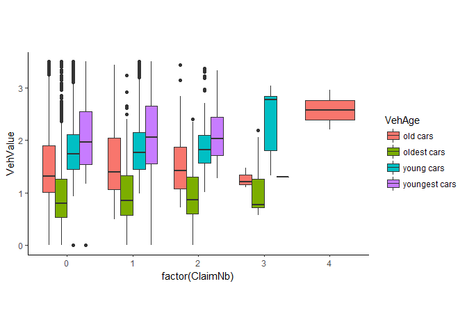
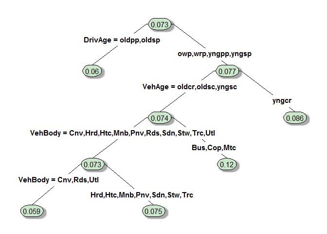
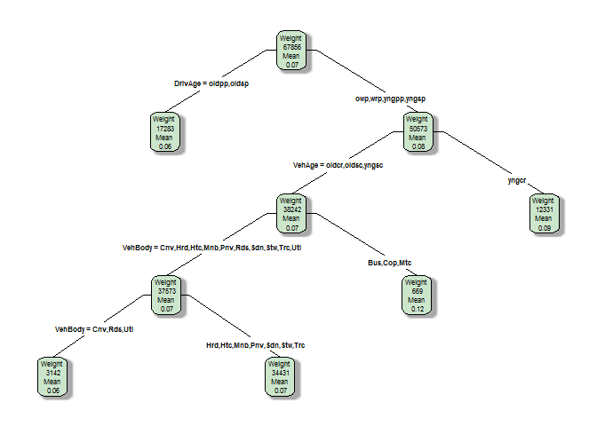
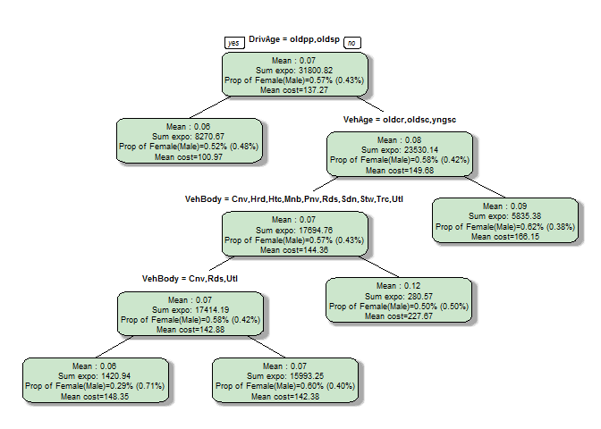
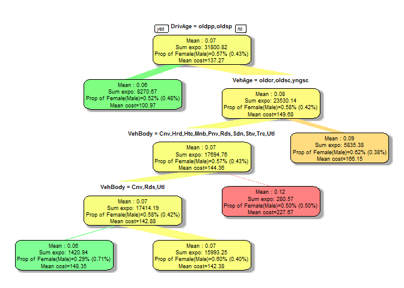

# R part node custom
Amaury Rault  


If you just want the solution, go directly to the **Solution** section.
This document is juste an example on a sample database.

# Introduction 

CART are widely used to perform descriptive analysis to find out the most important variables to explain a phenomenon. Thanks to the `rpart` package, it is really easy to build such trees. For instance let's have a look at a simple tree.


```r
# Model
library(rpart)

# Graphics
library(ggplot2)
library(rpart.plot)
```

First, we load the  database for this example.


```r
install.packages("CASdatasets", repos = "http://cas.uqam.ca/pub/R/")
library(CASdatasets)
data(ausprivauto0405)
str(ausprivauto0405)
```

```
## 'data.frame':	67856 obs. of  9 variables:
##  $ Exposure   : num  0.304 0.649 0.569 0.318 0.649 ...
##  $ VehValue   : num  1.06 1.03 3.26 4.14 0.72 2.01 1.6 1.47 0.52 0.38 ...
##  $ VehAge     : Factor w/ 4 levels "old cars","oldest cars",..: 1 3 3 3 2 1 1 3 2 2 ...
##  $ VehBody    : Factor w/ 13 levels "Bus","Convertible",..: 5 5 13 11 5 4 8 5 5 5 ...
##  $ Gender     : Factor w/ 2 levels "Female","Male": 1 1 1 1 1 2 2 2 1 1 ...
##  $ DrivAge    : Factor w/ 6 levels "old people","older work. people",..: 5 2 5 5 5 2 2 3 4 2 ...
##  $ ClaimOcc   : int  0 0 0 0 0 0 0 0 0 0 ...
##  $ ClaimNb    : int  0 0 0 0 0 0 0 0 0 0 ...
##  $ ClaimAmount: num  0 0 0 0 0 0 0 0 0 0 ...
```

In this database, we have :

+ `Exposure` : The number of policy years.
+ `VehValue` : The vehicle value in thousand of AUD.
+ `VehAge` : The vehicle age group.
+ `VehBody` : The vehicle body group.
+ `Gender` : The gender of the policyholder.
+ `DrivAge` : The age of the policyholder.
+ `ClaimOcc` : Indicates occurence of a claim.
+ `ClaimNb` : The number of claims.
+ `ClaimAmount` : The sum of claim payments.

We are going to study the variable `ClaimNb`. Obviously, these variables seem to matter when it comes to explain the occurence of a claim.


```r
ggplot(data = ausprivauto0405,aes_string(y="VehValue",x="factor(ClaimNb)",fill="VehAge"))+
      geom_boxplot()+theme_classic()+ylim(c(0,3.5))+coord_equal(ratio=0.8)
```

```
## Warning: Removed 5652 rows containing non-finite values (stat_boxplot).
```




# Basic trees

Even if a tree is not suited for such analysis - because the frequency is so low that it will tends to classify everybody as "0-Claims" - it has a simple but relevant visual.


```r
mytree=rpart(ClaimNb~VehAge+VehBody+DrivAge,data=ausprivauto0405,method ="poisson",cp=0)
pfit<- prune(mytree, cp=mytree$cptable[5,"CP"])
prp(pfit,type=4,shadow.col="darkgray",box.col=rgb(0.8,0.9,0.8))
```



By default, with `type=4` the `rpart.plot`package only shows the mean of each node. One might want to know more about each node. The `prp` function has an option `node.fun` that helps you customize the output. 


```r
pfit<- prune(mytree, cp=mytree$cptable[5,"CP"])

# Adding the weight of each node
node.fun1 <- function(x, labs, digits, varlen)
{
  paste("Weight \n ",x$frame$wt,"\nMean\n",round(x$frame$yval,2))
}
prp(pfit,type=4,shadow.col="darkgray",box.col=rgb(0.8,0.9,0.8),node.fun = node.fun1)
```



That's a good first step, but I have to work with indicators calculated in the `frame` dataset of my tree.


```r
str(mytree$frame)
```

```
## 'data.frame':	391 obs. of  9 variables:
##  $ var       : Factor w/ 4 levels "<leaf>","DrivAge",..: 2 4 3 4 4 2 1 3 4 1 ...
##  $ n         : int  67856 17283 13648 10241 4204 140 36 104 73 19 ...
##  $ wt        : num  67856 17283 13648 10241 4204 ...
##  $ dev       : num  26768 6008 4568 3336 1298 ...
##  $ yval      : num  0.0728 0.0601 0.057 0.0549 0.0507 ...
##  $ complexity: num  2.00e-03 3.61e-04 1.32e-04 8.68e-05 8.00e-05 ...
##  $ ncompete  : int  2 2 2 2 2 2 0 1 0 0 ...
##  $ nsurrogate: int  1 0 0 0 0 1 0 0 1 0 ...
##  $ yval2     : num [1:391, 1:2] 0.0728 0.0601 0.057 0.0549 0.0507 ...
```

To display other indicators, we need to calculate our indicators by ourselves. To do so, we need a function that will subset our dataframe, and keep all elements associated to one leaf. 

# Solution

And here is the code you need :


```r
subset.rpart <- function(tree, node = 1L) {
  ## returns subset of tree$call$data used on any node
  data <- eval(tree$call$data, parent.frame(1L))
  wh <- sapply(as.integer(rownames(tree$frame)), parent)
  wh <- unique(unlist(wh[sapply(wh, function(x) node %in% x)]))
  data[rownames(tree$frame)[tree$where] %in% wh[wh >= node], ]
}
parent <- function(x) {
  ## returns vector of parent nodes
  if (x[1] != 1)
    c(Recall(if (x %% 2 == 0L) x / 2 else (x - 1) / 2), x) else x
}
```

Now we are totally free to build our own `node.fun` and calculate what we want in the `node.fun`.


```r
f <- function(x, labs, digits, varlen) {
  nodes <- as.integer(rownames(x$frame))
  z <- sapply(nodes, function(y) {
    data <- subset.rpart(x, y)
    list(mean_target=mean(data$ClaimNb),
         sum_ex = sum(data$Exposure),
         prop_female=sum(data$Gender=="Female")/nrow(data),
         prom_male=sum(data$Gender=="Male")/nrow(data),
         mean_claim=mean(data$ClaimAmount))
  })
  sprintf('Mean : %.2f\nSum expo: %.2f\nProp of Female(Male)=%.2f%% (%.2f%%)\nMean cost=%.2f', z[1, ], z[2, ], z[3,],z[4,],z[5,])
}
```

All you have to change are the data calculated in the `z list`, and the printed output in the `sprintf` function. 


```r
prp(pfit, type=1, extra=100, fallen.leaves=FALSE,
    shadow.col="darkgray", box.col=rgb(0.8,0.9,0.8),
    node.fun = f)
```



In any prp format :

```r
y <- -pfit$frame$yval
max <- max(y)
min <- min(y)
cols <- rainbow(99, s=0.5,end=.36)[
ifelse(y >  y[1], (y-y[1]) * (99-50) / (max-y[1]) + 50,
(y-min)  * (50-1)  / (y[1]-min) + 1)]

prp(pfit, type=1, extra=100, fallen.leaves=FALSE,
    shadow.col="darkgray",  branch.col=cols, box.col=cols,
    node.fun = f,branch.type=5)
```


